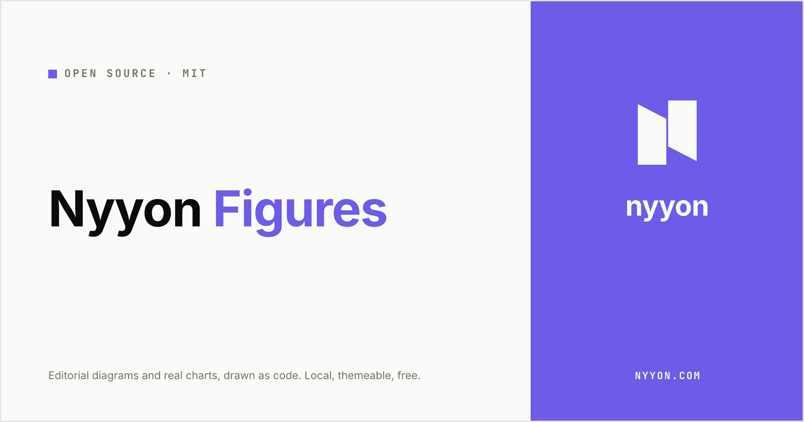
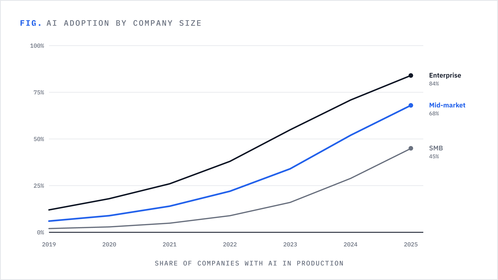
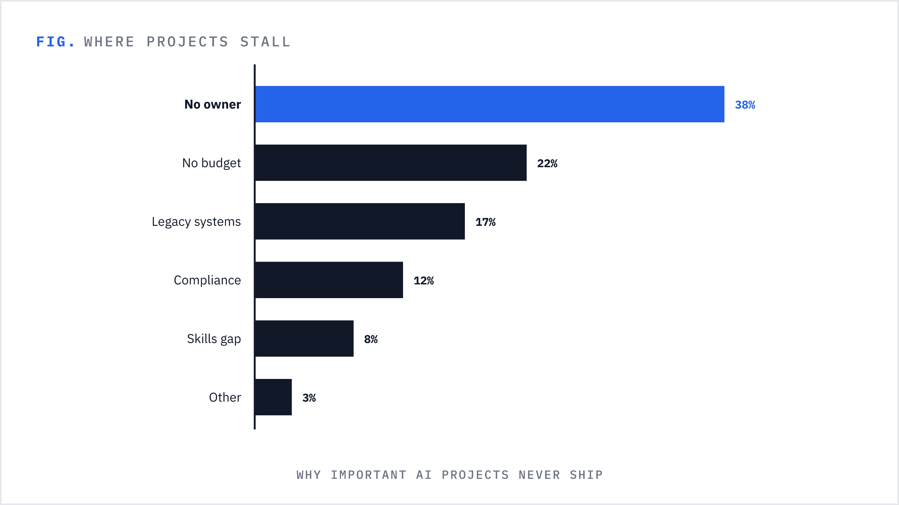
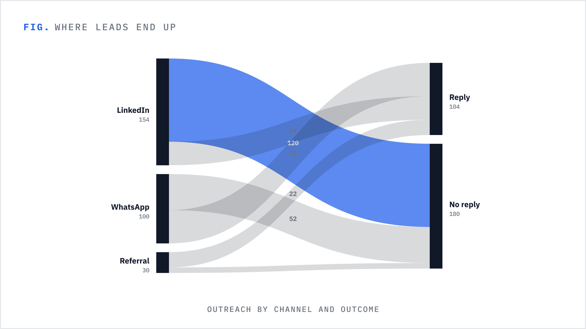
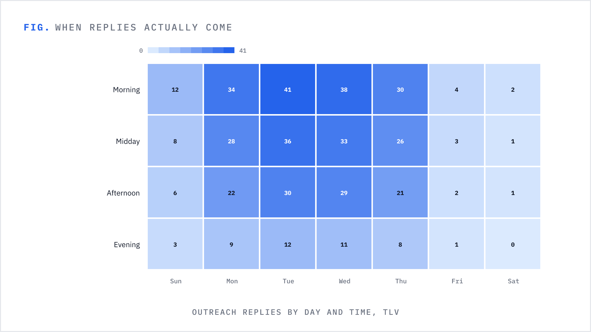
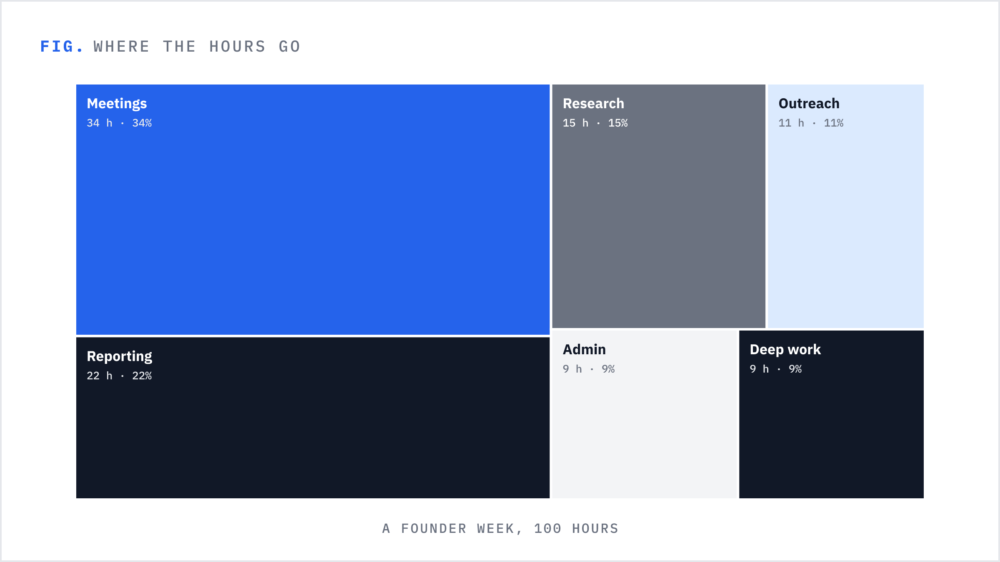
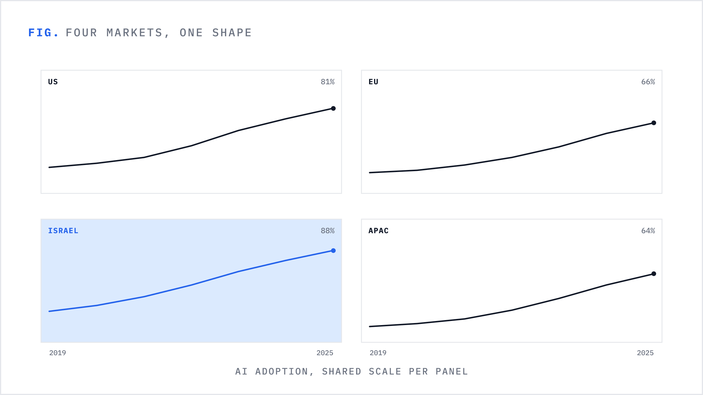
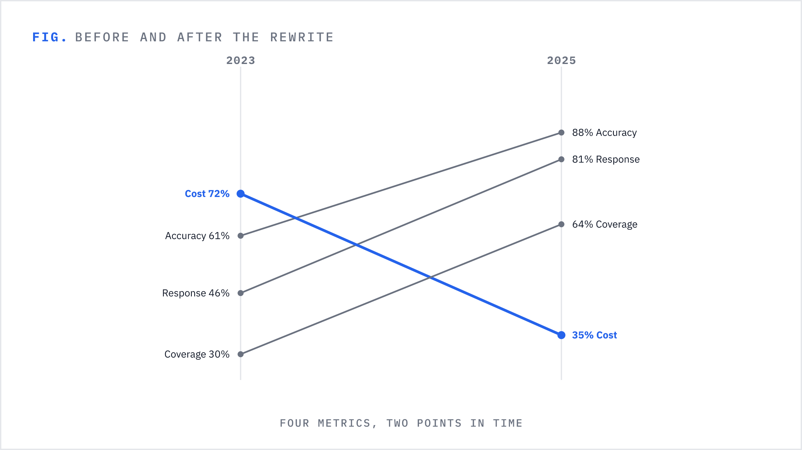
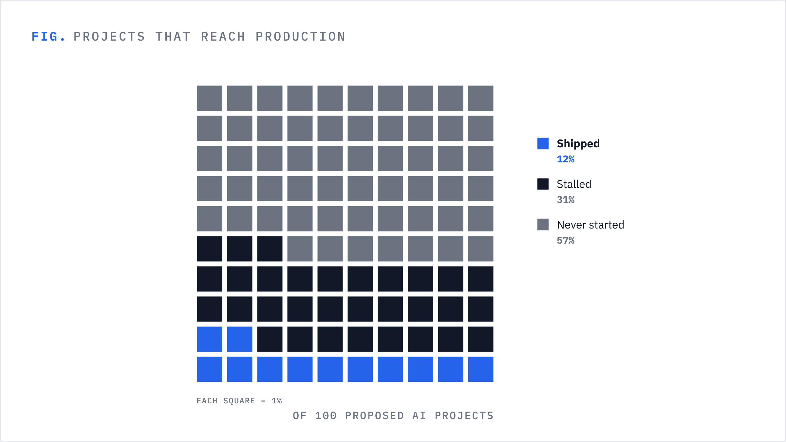

# nyyon-figures



A **local MCP server** that renders editorial diagrams and featured covers from a spec — for *any* brand, not just nyyon. No network, no model, nothing leaves the machine — the calling assistant does the thinking, this tool does the drawing.

It ships three things:

- **Templates** — 37 parametric, content-agnostic shapes: 17 diagram templates (story shapes) + 20 data-chart templates (`chart_*`, real numbers on real scales) + a 1200×630 featured cover, drawn as code (SVG → PNG via resvg at 2×, or **animated SVG**).
- **Settings** — a brand-themeable paper/ink theme with a single accent. Colors, accent, wordmark and URL are all overridable (file or env); it ships with nyyon's look (`#6C5CE7`, Inter + JetBrains Mono) as the default.
- **Reasoning prompt** — how to map an article to a *set* of figures (which shape per idea, anchored to the sentence it illustrates, varied across the piece) + a cover, including a chart-selection guide (pick by goal, the Datawrapper method).

## The 17 diagram templates

`contrast` · `layers` · `cycle` · `fanout` · `columns` · `grid` · `funnel` · `timeline` · `quadrant` · `pyramid` · `venn` · `venn3` · `table` · `pipeline` · `radial` · `bigstat` · `progression`

Each uses the accent as a *signal*: the `FIG.` mark, the primary arrowheads, and the single focal "point" of the diagram (the goal node, the source, the winning quadrant, the apex…).

## The 20 data-chart templates

For when the idea is backed by **real numbers**. Organized by goal, following [Datawrapper's chart-types guide](https://www.datawrapper.de/blog/chart-types-guide):

| goal | templates |
|------|-----------|
| change over time | `chart_line` · `chart_multiples` · `chart_area` (stacked/share/stream) · `chart_column` · `chart_slope` · `chart_arrow` |
| shares of a whole | `chart_bar` · `chart_pie` (pie/donut) · `chart_parliament` · `chart_waffle` · `chart_treemap` · `chart_marimekko` · `chart_bar_stacked` |
| amounts | `chart_bar` · `chart_bar_grouped` · `chart_bar_split` (incl. population pyramids) · `chart_dot` · `chart_prop_area` |
| relationships | `chart_scatter` (bubble via `size`) · `chart_heatmap` |
| flows | `chart_sankey` |

Chart craft is enforced in the renderers, not requested of the caller: bars, columns, areas and waffles always start at zero; line ends and bar ends are labeled directly instead of via legends; bubbles and proportional shapes scale by **area**, never radius; small multiples share one scale; empty or flat data renders a clean labeled frame, never a NaN SVG. Geo maps are deliberately absent (an offline renderer has no shape data): reach for `chart_bar` or `chart_heatmap` by region instead.

### Showcase

| | |
|---|---|
|  |  |
|  |  |
|  |  |
|  |  |

## Animation

Pass `format: "svg"` + `animate: true` to `render_figure` / `render_set` and you get a **self-animating SVG** instead of a flat PNG: every element fades in on a staggered entrance, holds, then exits — one smooth 8s loop, forever. The "traveling" shapes (`timeline`, `cycle`, `radial`) also get an accent dot gliding their path. Pure SVG — SMIL `<animateMotion>` + CSS `@keyframes`, **no JS, no dependencies**, and it honors `prefers-reduced-motion`. Use it for the web/inline; keep PNG for og:images, email, and link previews (animation doesn't survive those, and a rasterized SVG is just its first frame).

## Tools

| tool | what it does |
|------|--------------|
| `figures_for_article` | **Start here.** Article + a `design` (`auto` / `all` / `cover` / a template name) → a short brief telling you exactly what to produce, then render. Token-lean: a specific design returns only that template's schema. |
| `list_templates` | List all templates + the cover with their slot schemas. |
| `get_settings` | The active theme — colors, fonts, sizes, brand (reflects runtime changes). |
| `set_theme` | Adjust the global look — colors / fonts / brand — for all later renders. |
| `render_figure` | `{ template, slots, format?, animate? }` → a diagram PNG (or animated SVG). Returns the file path. |
| `render_cover` | `{ title, kicker?, highlight?, sub?, style? }` → the 1200×630 cover PNG. |
| `render_set` | A whole article set (`figures[]` + optional `cover`) in one call; `format`/`animate` apply to the figures. |

## Two ways to use it

**Article → figures:**
1. `figures_for_article` with the article + `design` → follow the returned brief to produce the spec.
2. `render_set` (or `render_cover`) → PNGs written locally; embed them, use the cover as featured/OG. Show the renders.

**Ad-hoc one-off** — just call `render_figure` directly, e.g. *"a venn of X and Y overlapping Z"* → `{ template: "venn", slots: { left_label: "X", right_label: "Y", overlap_label: "Z" } }`. No article needed.

Re-theme anytime with `set_theme` (or env / `src/settings.js`).

## Install (Claude / MCP)

```bash
npm install
```

Then add to your MCP client config:

```json
{
  "mcpServers": {
    "nyyon-figures": { "command": "node", "args": ["/ABSOLUTE/PATH/nyyon-figures/src/index.js"] }
  }
}
```

Or with the CLI: `claude mcp add nyyon-figures -- node /ABSOLUTE/PATH/nyyon-figures/src/index.js`

## Settings & overrides

Edit `src/settings.js`, or override at runtime via env:

- `NYYON_FIGURES_ACCENT` — accent hex (default `#6C5CE7`)
- `NYYON_FIGURES_PAPER` / `NYYON_FIGURES_INK` — background / foreground
- `NYYON_FIGURES_BRAND_NAME` — wordmark text on the cover (default `nyyon`)
- `NYYON_FIGURES_BRAND_URL` — URL printed on the cover (default `nyyon.com`)
- `NYYON_FIGURES_BRAND_MARK` — SVG path (~64×70 box) for the logo mark; `""` = text-only wordmark + plain accent hub
- `NYYON_FIGURES_OUT` — directory for rendered PNGs (default `$TMPDIR/nyyon-figures`)

So a different brand is one line: `NYYON_FIGURES_BRAND_NAME='Acme' NYYON_FIGURES_BRAND_URL='acme.io' NYYON_FIGURES_BRAND_MARK='' NYYON_FIGURES_ACCENT='#0EA5E9'`.

## Test

```bash
npm test   # renders one of every template + the cover into tmp-smoke/
```
